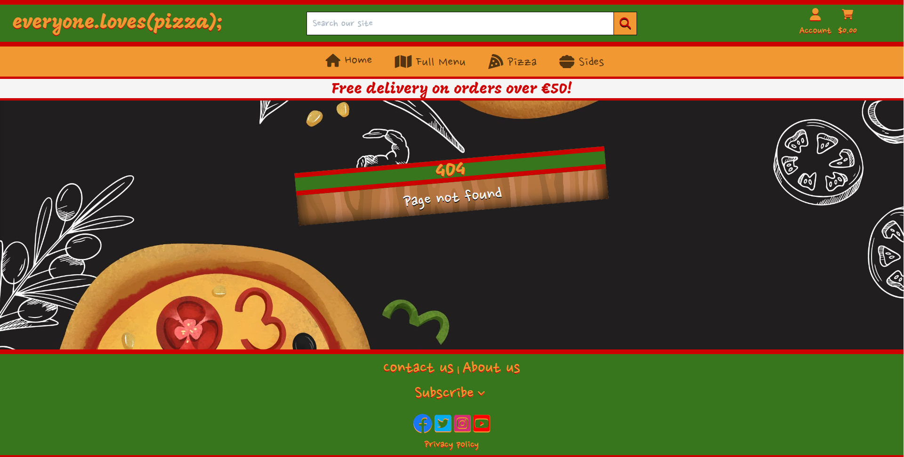

# everyone.loves(pizza);

everyone.loves(pizza); is a pizza restaurant and takeaway located in Dublin City. As it name suggests, it has ties to the IT industry, and its location puts it near major technology centres in the capital city. Although its doors are open to anyone and everyone, it expects the majority of its patrons to be workers from local IT companies, i.e. programmers. It is a light-hearted, fun place that offers delicious food - a reward for our hard-working developers! We expect these people to file in to celebrate and unwind after the completion of an intense sprint or project, or just for a bite to eat for lunch.

Our menu is entirely vegan-friendly, reflecting our forward-thinking ethos. In many ways, our developers are shaping the world to come, and we want to support them in that. We want them to feel like we are right there with them at the bleeding edge. A modern restaurant / takeaway for the most modern of people.

At the same time, we want to project a fun, non-intimidating image - we want to be a place where developers can let go and unwind - for this reason, everyone is equal when they're eating in this restaurant. People shouldn't be discouraged by the idea that this is a pizzeria for programmers - when the programmers are here, they aren't programmers, they're pizza-lovers, like <strong>everyone</strong> else!

## Technologies used
<ul>
    <li>HTML</li>
    <li>CSS</li>
    <li>JavaScript</li>
    <li>Markdown</li>
    <li>Git</li>
    <li>GitPod</li>
    <li>GitHub</li>
    <li>Bootstrap 5</li>
    <li>jQuery</li>
    <li>Python</li>
    <li>Django</li>
    <li>ElephantSQL</li>
    <li>Amazon AWS</li>
    <li>Heroku</li>
    <li>Stripe</li>
</ul>

## Features

### Existing features

<strong>(Note: The screenshots below are from a slightly earlier version of the project, and may contain some minor details that are not present in the final submission.)</strong>

 

<strong>1. Header with navigation bar containing search bar, user profile link, and shopping cart link</strong>

The header at the top of the page contains the site logo, as well as a navbar that enables the user to interact with the accounts side of the site, as well as their user profile if they are logged in. If they are not logged in, the Login option will be visible to them, as will the Register option, whereas if they are logged in, Logout will be visible. The superuser menu management option will also be included in this dropdown menu if the logged in user is a superuser.

The header also contains a search bar, into which a search term can be entered, and then submitted. Searching will navigate to the Menu page, showing any menu items that match the search term:

The Full Menu link on the navigation menu is a dropdown. The user has the option to sort the contents of the menu before displaying it, or to simply display the menu normally:

The header has a slightly different appearance on mobile screens. The bottom part of it can be expanded and collapsed using the button on the left, and similarly, the search bar can be expanded and collapsed by clicking the Search button:

 

<strong>2. Site footer with social media links and contact us page link</strong>

The footer is less busy than the header. It contains icon links to Facebook, Youtube, Instagram, and Twitter, as well as a link to the About section of the home page, a link to the Contact Us form page, and a link that expands a Mailchimp email subscription form:

 

<strong>3. Login, Logout, Register, and Password Reset pages</strong>

Through the user dropdown mentioned in section 1 above, the user can access the following pages:

If the user signs up to the site, they will be notified of an email confirmation link that has been sent to their email address, and if they follow that link, they will have to click a button to confirm said address:

If they user cannot remember their password, at the login screen, there is a link to the password reset page, where they must enter and submit their registered email address. They will be presented with a notification of a link sent to their email, which will take them to the password reset form if they follow it. Completing this form successfully displays a message.

<strong>4. Home page with Menu link, About Us section, and Featured Menu Items section</strong>

When the user navigates to the site's main URL, they will be presented with this page. It contains a jumbotron at its top, which contains a charming pizza button that links to the Menu page:

Below this is the About section, which contains a short blurb about the business, an embedded Google Map pinpointing its location, information about opening and delivery hours, and the address, and finally an image of the restaurant interior:

Below that is the Featured section, which contains 4 menu items that the restaurant wants to highlight. Each item has an "Order Now" button that takes the user to that item's individual page:

Note that the Home page, and several other pages on the site, has a Back-to-Top button fixed at its bottom right corner so that users can quickly and easily jump back to the top of the long page that they are currently on:

 

<strong>5. Menu page divided into Pizzas and Sides sections</strong>

If the user clicks the Menu button on the jumbotron on the home page, or clicks one of the options on the lower part of the header navigation menu, they will be taken to the Menu page, which displays differently depending on how the user has chosen to sort its contents, or if the user has entered a search term into the search bar. In its basic state though, the Menu page is divided into two sections - one for Pizzas, and another for Sides:

If the user searches the menu, the Menu page will appear something like this:

The Sorting dropdown can be found at the top of the Menu page and to the right. It enables the user to sort the Menu contents by name, category, or price, and selecting one of these options again alters the appearance of the Menu page:

Note that both the Search and Sort versions of the Menu page remove the Pizza and Sides sections, and display all relevant items together in a single section.

Lastly, for superusers, the "superuser zone" will be visible beneath each menu item. This zone contains Edit and Delete links, that enable the superuser to interact with the database underlying the website from the website itself. Edit takes you to the Edit Item page, while the Delete button removes the given item from the database:

 

<strong>6. Menu item detail pages</strong>

Each menu item on the Menu page has a link to its individual page that can be reached by clicking the item's image, or by clicking the "Order Now" button. This page differs depending on the category (pizza or side) of item the user has navigated to. A pizza's image has a circular container, while a side's image has a rectangular one:

The size dropdown offers three sizes - Small, Medium, and Large, and choosing one triggers JavaScript that changes the price. The quantity selector does not have this effect, so as not scare off customers! The "Rating" refers to the average review score given to the item (more below), and the tag icon and text above the rating is the item's category (clicking on this takes them to a filtered version of the Menu page).

The Add to Cart button adds the item at the given quantity and size to the shopping cart (more in section 7), and the Keep Shopping button returns the user to the Menu page.

Note that there is a superuser zone on these pages too. It is the same as the one on the items on the Menu page.

Note also the star in the corner of the information container on the right side of this page - this is the Favourite button. Clicking it makes that item the user's favourite item. Only one item can be made a favourite at a time. If this button is clicked, it takes on a golden appearance:

Each menu item detail page contains a humorous description as well. For example:

If the user scrolls down, they will find the Reviews section of that item's page. This section is paginated, with each page containing 9 reviews, and the reviews themselves order by most recently added. A review score is out of 5, and is represented with stars, and an Italian word:

Note that the colourful words above the reviews can be clicked on to filter the displayed reviews according to their score.

Below the Reviews section then, is the review form, where reviews are actually written and submitted. This form is only visible to logged-in users.

 

<strong>7. The shopping cart</strong>

The shopping cart page can be accessed from the header (see section 1). It displays any items that the user has added to the shopping cart. The same item will appear more than once if more than one size of it has been added, but several of a single size will be represented with one row, and the quantity value will reflect the desired amount:

Note that the quantity of a given item can be modified from the shopping cart page by using the quantity selector and clicking Update. An item can also be removed from the cart altogether by clicking the Remove button.

At the bottom of this page, the user can find the Secure Checkout button, and the Keep Shopping button. The former takes them to the Checkout page, while the latter returns them to the Menu page. Also at the bottom of the page is the calculated cost of the user's order, which includes a breakdown of the basic cost and the delivery cost, as well as the amount more that the user has to spend if they want to be entitled to free delivery:

 

<strong>8. The checkout page</strong>

The user is taken to the checkout page when they click the Secure Checkout button on the shopping cart page. This page is divided into two halves - one containing a form into which the user must enter their delivery information, and the other containing a summary of their order (which cannot be modified from this page - the user must return to the shopping bag page to do this):

At the bottom of the delivery information form, there is a checkbox which, if checked, saves the delivery information that the user has entered to their user profile, but this is only visible to logged in users (who necessarily have user profiles).

Below said form is the Stripe card element into which the user enters their payment details. This form dynamically responds to the user's input, detecting if what they have entered is valid or not. The Adjust Cart button takes the user back to the shopping cart, and the Complete Order button processes their payment and places their order:

When the user clicks Complete Order, a transparent overlay with a spinning pizza icon appears to indicate to them that their order is being processed:

And lastly, if their order is successful, the user will be shown a success page that summarises their order and notifies them of a confirmation email that has been sent to them:

 

<strong>9. The user profile page - current favourite, delivery information, order history, review history, message history</strong>

As alluded to before, a user who registers for an account with the site will automatically obtain a profile. A user's profile can be accessed from the header if they are logged in. The icon with the user's username below it is a dropdown menu (as seen in section 1), and one of the options in that menu is "My Profile".

The user profile page contains a lot of information. At the very top, the user's favourite item on the menu will be displayed, if they have chosen one:

Below this are two sections - one for the user's default delivery information, and another for their order history. The former is a form that can be updated, and whatever information is saved will auto-populate the order form on the checkout page (see section 8). Incidentally, choosing to save your delivery information from the checkout page will populate this default information form on the profile page:

The order history section is a list of historical orders, and each one's green order number can be clicked to navigate to an order summary page for it. This page is the same as the success page seen after successfully checking out, but is subtly different:

Below the two sections above, there is the Review history section, which looks very similar to the Review section on a given menu item's page, but only displays reviews added by the logged-in user. Like said section, this one is also paginated, displaying 9 reviews per page, and the reviews are once again ordered by most recent. Also like said section, this section can be filtered by clicking the colourful words just above the reviews.

Lastly, and at the bottom of the profile page, is the Message history section. This section contains a list of all the messages sent by the user via the Contact Us page, and displays them according to the date and time they were sent, from latest to earliest. This section is also paginated, but displays 5 messages per page. Messages look similar to reviews, but are visually different enough so that the user can tell the two apart. The message body itself can be expanded, an option that appears if its size exceeds a certain width:

 

<strong>10. Menu management pages</strong>

There is a page from which new items can be added to the menu, and it is only accessible to superusers. It can be found in the same dropdown menu that contains the profile page link (see section 1), and is coloured in such a way as to denote that it is a superuser-only link. Clicking this link leads to this page:

There are two image selection fields on the above form - one for the image of the item as it appears on the menu, and another for the image of the item as it appears on its detail page and elsewhere. If you select an image, these controls will warn you that they need to have specific dimensions in order to appear properly on the site:

Lastly, there is the Edit page, which can be accessed from the "superuser zone" for an item on either the Menu page, or on the item's individual page. It looks the same as the Add page, but is pre-populated with that item's data:

 

<strong>11. Informational messages</strong>

There are too many actions on the site that trigger messages to show / list here, but here are screenshots of just a few (if you think that a message should appear for a given action, it probably does):

Note that the contents of your shopping cart will appear in some of the messages you receive, but not all of them. Whether or not this happens depends what page you are on when the message is generated.

 

<strong>12. Custom 404 page</strong>

Finally, if the user navigates to a page that does not exist on the site, or to a page for an object that does not exist in the database, they will be presented with a custom 404 page:

 

### Features yet to be implemented

<strong>Toppings system</strong>

When I first set out to make this project, I wanted to include an option for users who want to make their own pizzas, rather than having to choose a specific one from the menu. However, my mentor talked me out of this, and in hindsight, it probably was a little bit too ambitious.

<strong>Collection</strong>

This could probably be quite simply implemented, but at the time of writing, it's a little bit too late to be tinkering with things. Adding this would enable users to pick up a pizza if they lived outside of the radius to which the restaurant delivers.

<strong>User-staff communication page or chat window</strong>

The more modern solution to contacting website staff is to have a live chat system. This is not something I feel I would be able to implement just now, but I had considered adding a private page linked to a given message sent by a user to the staff. This page would work similarly to the bulletin pages from my previous project, with the message at the top, and a comment section below enabling conversation between the user and a member of staff. The current system I have is fairly archaic - the user awaits an email from a member of staff.

## Testing
<em>Please refer to TEST.md</em>

## Deployment

The process I followed to deploy this project is as follows:
<ol>
    <li>I began by creating a new database instance in <em>ElephantSQL</em>, choosing the <em>Tiny Turtle plan</em>, and selecting an Irish data centre (<em>EU-West-1</em>).</li>
    <li>Next, I created a new <em>Heroku</em> app, naming it <em>clp1991-everyone-loves-pizza</em>, and making sure to set its region to Europe.</li>
    <li>I copied the database URL on the details page for the database instance created in step 1, and set it as a value for a config var called <em>DATABASE_URL</em> in the Heroku app from step 2</li>
    <li>In my <em>GitPod workspace</em> for the project, I installed <em>dj_database_url</em> and <em>psycopg2</em>.</li>
    <li>I then used <em>pip3 freeze --local > requirements.txt</em> to update my <em>requirements.txt</em> file.</li>
    <li>In <em>settings.py</em> in my <em>Django files</em>, I added the following imports: <em>import os</em>, <em>import dj_database_url</em></li>
    <li>Using the commands <em>python3 manage.py dumpdata menu.Category > categories.json</em> and <em>python3 manage.py dumpdata menu.MenuItem > menu_items.json</em>, I created <em>JSON</em> representations of my database's data.</li>
    <li>Still in <em>settings.py</em>, I temporarily commented out the existing <em>DATABASES</em> variable, and created a new one, setting it to <em>DATABASES = {
     'default': dj_database_url.parse('') }</em>, pasting the URL from step 3 between the single quotes. This wired my project to the database hosted by <em>ElephantSQL</em>.</li>
    <li>I ran the <em>makemigrations</em> and <em>migrate</em> commands from my workspace to apply my project's database schema to the <em>ElephantSQL</em> database.</li>
    <li>I then used the <em>python3 manage.py loaddata</em> command twice, once for <em>categories.json</em>, and once for <em>menu_items.json</em>, to migrate some of the data in my database to the <em>ElephantSQL</em> one.</li>
    <li>I uncommented the <em>DATABASES</em> variable from step 8, and indented it inside an else (making sure that its <em>'default'</em> key was set to the following dictionary: <em>{'ENGINE': 'django.db.backends.sqlite3', 'NAME': os.path.join(BASE_DIR, 'db.sqlite3')},</em>). The if to this else was <em>if 'DATABASE_URL' in os.environ</em>, and contained the alternate <em>DATABASES</em> variable made in step 8. As only the Heroku app environment contains the <em>DATABASE_URL</em> variable, this if-else ensured that the <em>ElephantSQL</em> database would only be used for the production application. The reason for this is that <em>sqlite3</em> databases can only be used in the development environment, and are not supported by Heroku. In said if, I added this line: <em>DATABASES = {'default': dj_database_url.parse(os.environ.get('DATABASE_URL'))}</em>.</li>
    <li>Next, I installed <em>gunicorn</em> using <em>pip3 install</em>, and updated my <em>requirements.txt</em> file once again.</li>
    <li>Then, I created a <em>Procfile</em> for Heroku in the root directory, and added this line to it: <em>web: gunicorn everyone_loves_pizza.wsgi:application</em>.</li>
    <li>Over in my Heroku app, I added a temporary config var called <em>DISABLE_COLLECTSTATIC</em>, and set it to a value of 1.</li>
    <li>Next, in the Variables section of the GitPod workspace User Settings method, I added a variable called <em>DEVELOPMENT</em> and set it to True.</li>
    <li>In <em>settings.py</em>, I set the <em>DEBUG</em> variable to <em>'DEVELOPMENT' in os.environ</em>. This way, when running the app in the development environment, the value of <em>DEVELOPMENT</em> would equal True, as said variable would exist in the environment, but that same variable would equal False in the Heroku environment, as <em>DEVELOPMENT</em> would not exist there. In other words, <em>DEBUG</em> would now only equal True in the development environment, not in the production one.</li>
    <li>Next, I created a config var for my Heroku app called <em>SECRET_KEY</em>, and assigned a randomly generated Django <em>secret key</em> to it as a value. I used <em>Djecrety</em> to generate this key. I also created an environmental variable of the same name for my workspace environment, and set it to a different key, also generated by <em>Djecrety</em>. In <em>settings.py</em>, I added the line: <em>SECRET_KEY = os.environ.get('SECRET_KEY', '')</em>, which would get whatever the value of the <em>SECRET_KEY</em> environmental variable was, depending on the current environment.</li>
    <li>In the Deploy tab of my Heroku app, I clicked <em>Connect to GitHub</em>, searched for the repository for this project, and then connected to it.</li>
    <li>Then, on the same tab, after connecting to the project repository, I scrolled down and enabled <em>automatic deploys</em>. Now, if I was to push changes to GitHub from my workspace, these changes would also be pushed to the Heroku remote, updating the Heroku app with the newest version of the GitHub repository on which it was based.</li>
    <li>For compatibility reasons, and to ensure that the Heroku build process would succeed, I modified the <em>backports.zoneinfo</em> line, like so: <em>backports.zoneinfo==0.2.1;python_version<"3.9"</em>.</li>
    <li>Next, I visited <em>Amazon Web Services</em> to set up a bucket for my project's static files and media files. I logged in to AWS, and then searched for <em>S3</em>.</li>
    <li>On the S3 page, I clicked <em>Create Bucket</em>, and when prompted, gave that bucket the name <em>clp1991-everyone-loves-pizza</em>. I selected the eu-west-1 region, and unchecked <em>Block all public access</em>. I also checked the <em>ACLs enabled</em> and <em>Bucket owner preferred</em> options, before creating the bucket.</li>
    <li>On the list that appeared, I clicked into my newly-created bucket, and then on its Properties tab. Here, I checked both <em>Enabled</em> and <em>Host a static website</em>. I entered index.html and error.html for the index and error documents respectively, and then clicked Save changes.</li>
    <li>In the <em>Permissions</em> tab of the bucket, I clicked Edit, and pasted this into the <em>Cross-origin resource sharing</em> section: [{"AllowedHeaders": ["Authorization"],"AllowedMethods":["GET"],"AllowedOrigins": ["*"],"ExposeHeaders": []}]. This set up access between my Heroku app and my bucket.</li>
    <li>Using the DEVELOPMENT variable from the previous step, as well as an if-else, I set <em>ALLOWED_HOSTS</em> to the URL for the GitPod version of the page if DEVELOPMENT existed in the environment, and to the URL for the Heroku app if it did not.</li>
    <li>Next, in the <em>Bucket policy</em> section for my bucket, I clicked Edit, and then <em>Policy generator</em>. Here, I selected S3 Bucket Policy from the first dropdown menu. I left <em>Effect</em> set to <em>Allow</em>, entered * into the <em>Principal</em> field (to allow all), and then I selected <em>GetObject</em> from the <em>Actions</em> dropdown.</li>
    <li>From the <em>Bucket policy</em> section, I copied the <em>ARN</em>, and I pasted it into the ARN field in the policy generator. Then, I clicked Add Statement, followed by Generate Policy.</li>
    <li>I added /* within the quotes of the <em>Resource</em> key in the JSON object that appeared, copied said object, and then clicked Save changes.</li>
    <li>Lastly, in the <em>Access control link</em> section, I clicked Edit, and checked <em>List</em> next to <em>Everyone (public access)</em>. Then, I saved the changes.</li>
    <li>Next, I searched for IAM in AWS, which is Amazon's Identity and Access Management. Within this service, I created a <em>Group</em>, calling it <em>manage-everyone-loves-pizza</em>.</li>
    <li>Then, I clicked <em>Policies</em> on the same side panel where the create group option was, and then Create Policy. I clicked on the JSON tab on the page that appeared, and then Import policy. I searched for <em>AmazonS3FullAccess</em> and clicked Import. The selected policy appeared in the adjacent text field as JSON.</li>
    <li>Next, I copied the ARN from my Bucket policy, returned to the JSON policy from the previous step, and set the <em>Resource</em> key in it to a list. Inside this list, I added two strings - the Bucket ARN, and the Bucket ARN with /* at the end of it. The former refers to the bucket itself, while the latter refers to all of its contents.</li>
    <li>Moving on, I gave the policy the name <em>clp1991-everyone-loves-pizza-policy</em>, and the description "<em>Access to S3 bucket for everyone.loves.pizza static files.</em>", and then I clicked Create policy.</li>
    <li>I clicked on <em>User Groups</em> on the side panel again, and then into the group created above. I clicked on its <em>Permissions</em> tab and then on the <em>Add permissions</em> dropdown menu. From this dropdown menu, I selected <em>Attach policies</em>, checking the policy made in the previous step, and then clicking <em>Add permissions</em>.</li>
    <li>Next, I clicked on <em>User</em> on the same side panel from before, and then on <em>Add users</em>. I created a user called <em>everyone_loves_pizza_staticfiles_user</em>.</li>
    <li>Clicking Next, I was taken to a page where I checked the User Group I made several steps ago. I clicked Next again, and then <em>Add user</em>.</li>
    <li>Finally, I clicked on the <em>Security credentials</em> tab for the newly-created User, and scrolled down to the <em>Access keys</em> section, where I clicked <em>Create access key</em>. I chose <em>Third-party service</em> as the recipient of this access key, and added the description, "<em>To authenticate a user accessing an S3 bucket from a Heroku app</em>". I downloaded the .csv file that was created by this.</li>
    <li>Back in my project workspace, I used pip3 install to install <em>boto3</em> and <em>django-storages</em>, adding the latter to <em>INSTALLED_APPS</em> in settings.py as <em>'storages'</em>. Before proceeding, I updated requirements.txt once again.</li>
    <li>To my Heroku app, I added a config var called <em>USE_AWS</em>, and set it to True.</li> I also created the <em>AWS_ACCESS_KEY_ID</em> and <em>AWS_SECRET_ACCESS_KEY</em> config vars, setting them to values copied during the steps above.
    <li>Back in settings.py, I added this if statement and code: <em>if 'USE_AWS' in os.environ: AWS_STORAGE_BUCKET_NAME = 'clp1991-boutique-ado' AWS_S3_REGION_NAME = 'eu-west-1' AWS_ACCESS_KEY_ID = os.environ.get('AWS_ACCESS_KEY_ID') AWS_SECRET_ACCESS_KEY = os.environ.get('AWS_SECRET_ACCESS_KEY') AWS_S3_CUSTOM_DOMAIN = f'{AWS_STORAGE_BUCKET_NAME}.s3.amazonaws.com'</em>, which only runs when the <em>USE_AWS</em> exists in the environment, i.e. when the Heroku app is running.</li>
    <li>Next, I removed the <em>DISABLE_COLLECTSTATIC</em> config var from my Heroku app, as the next deployment to Heroku would automatically run <em>collectstatic</em> and copy my project's static files to the Bucket described in the if statement from the previous step.</li>
    <li>However, to ensure that this would happen, I had to create a .py file containing two special classes. I called this .py file <em>custom.storages.py</em> and into it, I imported settings.py, and <em>S3Boto3Storage</em> from <em>storages.backends.s3boto3</em>.</li>
    <li>The first class I created in the above .py file was called <em>StaticStorage</em>, which inherited <em>S3Boto3Storage</em>. Inside this class, I added this line: <em>location = settings.STATICFILES_LOCATION</em>.</li>
    <li>Next, I added a second class to the same .py file called <em>MediaStorage</em>, which also inherited <em>S3Boto3Storage</em>, and had an attribute called <em>location</em>, but this attribute I set to to <em>settings.MEDIAFILES_LOCATION</em></li>
    <li>Back in settings.py, I added the following within the <em>USE_AWS</em> if statement from before: <em>STATICFILES_STORAGE = 'custom_storages.StaticStorage' STATICFILES_LOCATION = 'static' DEFAULT_FILE_STORAGE = 'custom_storages.MediaStorage' MEDIAFILES_LOCATION = 'media' STATIC_URL = f'https://{AWS_S3_CUSTOM_DOMAIN}/{STATICFILES_LOCATION}' MEDIA_URL = f'https://{AWS_S3_CUSTOM_DOMAIN}/{MEDIAFILES_LOCATION}'</em>. With this in place, the next time I deployed to Heroku, it would run <em>collectstatic</em> during the build process to look for my project's static files, and then it would copy them in the S3 Bucket I set up previously. This would only happen for the Heroku app, however, as all of this depended on the <em>USE_AWS</em> variable existing in the environment.</li>
    <li>To improve performance, I added this at the top of the <em>USE_AWS</em> if statement: <em>AWS_S3_OBJECT_PARAMETERS = {'Expires': 'Thu, 31 Dec 2099 20:00:00 GMT','CacheControl': 'max-age-94608000',}</em>, which caches static files for a long time so that they don't have to be loaded back in frequently.</li>
    <li>At this point, I ran git add ., committed, and pushed, which triggered the automatic deploy over at Heroku, and created copies of my static files inside my S3 Bucket.</li>
    <li>Back in <em>S3</em>, I created a folder in my bucket called <em>media</em>, and selected the first option for server-side encryption. Then, I saved my project repository as a .zip file, extracted all the images in the media folder, and uploaded them to the media folder of the Bucket, making sure to check <em>Grant public-read access</em> under Permissions before doing so.</li>
    <li>Next, to ensure that the <em>Stripe</em> payment functionality of my site worked in the deployed app, I logged in to my Stripe account, navigated to the <em>Developers</em> section, clicked on <em>API keys</em>, and then copied both the <em>Publishable key</em> and the <em>Secret key</em>.</li> Using these keys as values, I created two more config vars for my Heroku app - <em>STRIPE_PUBLIC_KEY</em> and <em>STRIPE_SECRET_KEY</em>.
    <li>After this, I navigated to the <em>Webhooks</em> tab in the <em>Developers</em> section, and clicked on <em>Add Endpoint</em>. For the endpoint URL, I provided my Heroku app's URL with <em>/checkout/wh/</em> appended to it. Then, I selected <em>Receive all events</em> and clicked <em>Add Endpoint</em>.</li>
    <li>On the page that followed, I revealed the webhook's <em>signing secret</em> and then copied it. Back in my Heroku app, I added another config var called <em>STRIPE_WH_SECRET</em>, and set it to the copied value.</li>
    <li>The last thing to do was to enable the app to send emails to users using my gmail account. I navigated to this link: https://myaccount.google.com/apppasswords, and once there, selected <em>Mail</em> as the app, and <em>Other</em> as the device (typing <em>Django</em> after this). I made sure to copy the 16-character password that was generated by this.</li>
    <li>Back in my Heroku app, I created two more config vars: <em>EMAIL_HOST_USER</em> and <em>EMAIL_HOST_PASS</em>. The former I set to my gmail address, and the latter I set to the password I copied in the previous step.</li>
    <li>In settings.py, I moved the <em>DEFAULT_FROM_EMAIL</em> and <em>EMAIL_BACKEND</em> variables into an if that executed if the <em>DEVELOPMENT</em> variable was in the environment. To the else (i.e. when in the Heroku environment), I added this: <em>EMAIL_BACKEND = 'django.core.mail.backends.smtp.EmailBackend' EMAIL_USE_TLS = True EMAIL_PORT = 587 EMAIL_HOST = 'smtp.gmail.com' EMAIL_HOST_USER = os.environ.get('EMAIL_HOST_USER') EMAIL_HOST_PASSWORD = os.environ.get('EMAIL_HOST_PASS') DEFAULT_FROM_EMAIL = os.environ.get('EMAIL_HOST_USER')</em>. Now, if a user were to sign up for an account on the site, they would receive a verification email from my gmail account.</li>
    <li>Finally, for reasons of compatibility with Python, I added a Heroku config var called PORT, and set it to 8000.</li>
</ol>

 

Live links to this project:
- Heroku app: https://clp1991-everyone-loves-pizza-a520c76d55de.herokuapp.com/
- Repository: https://github.com/ChrisLPlumb91/everyone-loves-pizza
- Project board: https://github.com/users/ChrisLPlumb91/projects/6
- Facebook page (screenshots below): https://www.facebook.com/everyonelovespizzadublin/

## Credits

The fonts used across the website were taken from Google Fonts:
- [Mogra](https://fonts.google.com/specimen/Mogra?query=mogra)
- [Nanum Pen Script](https://fonts.google.com/specimen/Nanum+Pen+Script?query=nanum)

The icons used across the website were taken from Font Awesome:
- [arrow-up](https://fontawesome.com/v6/icons/arrow-up?f=classic&s=solid)
- [bowl-food](https://fontawesome.com/v6/icons/bowl-food?f=classic&s=solid)
- [cart-shopping](https://fontawesome.com/v6/icons/cart-shopping?f=classic&s=solid)
- [chevron-down](https://fontawesome.com/v6/icons/chevron-down?f=classic&s=solid)
- [chevron-left](https://fontawesome.com/v6/icons/chevron-left?f=classic&s=solid)
- [chevron-up](https://fontawesome.com/v6/icons/chevron-up?f=classic&s=solid)
- [circle-exclamation](https://fontawesome.com/v6/icons/circle-exclamation?f=classic&s=solid)
- [facebook](https://fontawesome.com/v6/icons/facebook?f=brands&s=solid)
- [house](https://fontawesome.com/v6/icons/house?f=classic&s=solid)
- [lock](https://fontawesome.com/v6/icons/lock?f=classic&s=solid)
- [magnifying-glass](https://fontawesome.com/v6/icons/magnifying-glass?f=classic&s=solid)
- [map](https://fontawesome.com/v6/icons/map?f=classic&s=solid)
- [pizza-slice](https://fontawesome.com/v6/icons/pizza-slice?f=classic&s=solid)
- [square-instagram](https://fontawesome.com/v6/icons/square-instagram?f=brands&s=solid)
- [square-twitter](https://fontawesome.com/v6/icons/square-twitter?f=brands&s=solid)
- [square-youtube](https://fontawesome.com/v6/icons/square-youtube?f=brands&s=solid)
- [tag](https://fontawesome.com/v6/icons/tag?f=classic&s=solid)
- [user](https://fontawesome.com/v6/icons/user?f=classic&s=solid)

Using https://gauger.io/fonticon/, I converted a the pizza-slice Font Awesome icon into a favicon for the website.

The images used across the website were taken from the following pages:
- [Sitewide background](https://www.freepik.com/free-vector/restaurant-mural-wallpaper-with-pizza_10290897.htm)
- [Menu button](https://pngtree.com/freepng/pizza-cartoon-with-meat-and-mushrooms_6809005.html)
- [Jumbotron background](https://www.freepik.com/free-vector/restaurant-mural-wallpaper_10372997.htm)
- [Wood background](https://www.dreamstime.com/brown-wooden-surface-striped-fiber-template-your-design-natural-wenge-wood-texture-seamless-background-vector-illustration-image114043713)
- [Restaurant photo](https://pizzadoughco.uk/wp-content/uploads/2022/11/DSC09826-scaled-1.jpg)
- [Diavola](https://cdn.tasteatlas.com//images/dishes/1cc1037943e6455387594cf172b5dbdd.jpg?w=1200)
- [Vegetariana](https://upload.wikimedia.org/wikipedia/commons/5/58/Pizza_vegetariana.jpg)
- [Valtellina](https://guide.pizza/wp-content/uploads/2022/12/Valtellina-Pizza-Italy.jpg)
- [Capricciosa](https://i0.wp.com/patisseriebelga.com/wp-content/uploads/2018/12/capricciosa.jpg?fit=500%2C500&ssl=1)
- [Boscaiola](https://foursquare.com/v/lupita-pizzaria/5d8a126aebc5f80008b06ff2?openPhotoId=613a500026a9927f9ec01f99)
- [Pugliese](https://media.leverans.ru/product_images_inactive/ufa/filadelfiia/11_grecheskaya.jpg)
- [Melanzane](https://images.newyorkpizza.nl/Products/Original/Melanzane_Parmigiana-8247.png)
- [Quattro formaggi](https://cdn.shopify.com/s/files/1/0944/3476/articles/FourCheese_Resized.jpg?crop=center&height=800&v=1598453458&width=800)
- [Bruschetta](https://theclevermeal.com/wp-content/uploads/2022/05/bruschetta-with-mozzarella_2b.jpg)
- [Calzone](https://hips.hearstapps.com/hmg-prod/images/190130-calzone-horizontal-2-1549421238.png?crop=0.668xw:1.00xh;0.260xw,0&resize=1200:*)
- [Caprese salad](https://i2.wp.com/www.downshiftology.com/wp-content/uploads/2019/07/Caprese-Salad-2-2.jpg)
- [Garlic bread](https://www.ambitiouskitchen.com/wp-content/uploads/2023/02/Garlic-Bread-5.jpg)
- [Garlic pizza bread](https://glutenfreecuppatea.co.uk/wp-content/uploads/2020/09/gluten-free-garlic-bread-pizza-2.jpg)
- [Garlic pizza dough balls](https://biteontheside.com/wp-content/uploads/2021/07/pizza-dough-garlic-balls-8-768x1024.jpg)
- [Margherita al taglio](https://vandemoortele.com/sites/default/files/styles/square_product/public/07703da86336f2f7c3dacae3f7de69c52c8af72d.jpg?itok=0tezHLpP)