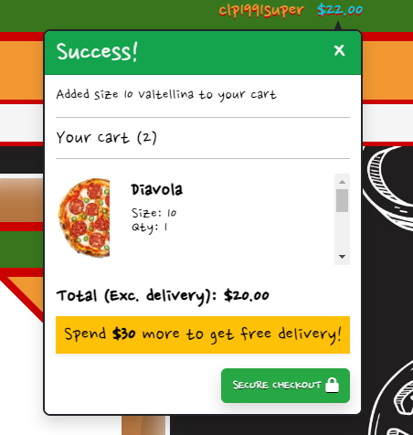

# everyone.loves(pizza);

everyone.loves(pizza); is a pizza restaurant and takeaway located in Dublin City. As it name suggests, it has ties to the IT industry, and its location puts it near major technology centres in the capital city. Although its doors are open to anyone and everyone, it expects the majority of its patrons to be workers from local IT companies, i.e. programmers. It is a light-hearted, fun place that offers delicious food - a reward for our hard-working developers! We expect these people to file in to celebrate and unwind after the completion of an intense sprint or project, or just for a bite to eat for lunch.

Our menu is entirely vegan-friendly, reflecting our forward-thinking ethos. In many ways, our developers are shaping the world to come, and we want to support them in that. We want them to feel like we are right there with them at the bleeding edge. A modern restaurant / takeaway for the most modern of people.

At the same time, we want to project a fun, non-intimidating image - we want to be a place where developers can let go and unwind - for this reason, everyone is equal when they're eating in this restaurant. People shouldn't be discouraged by the idea that this is a pizzeria for programmers - when the programmers are here, they aren't programmers, they're pizza-lovers, like <strong>everyone</strong> else!

## Technologies used
<ul>
    <li>HTML</li>
    <li>CSS</li>
    <li>JavaScript</li>
    <li>Markdown</li>
    <li>Git</li>
    <li>GitPod</li>
    <li>GitHub</li>
    <li>Bootstrap 5</li>
    <li>jQuery</li>
    <li>Python</li>
    <li>Django</li>
    <li>ElephantSQL</li>
    <li>Amazon AWS</li>
    <li>Heroku</li>
    <li>Stripe</li>
</ul>

## Features

### Existing features

<strong>(Note: The screenshots below are from a slightly earlier version of the project, and may contain some minor details that are not present in the final submission.)</strong>

 

<strong>1. Header with navigation bar containing search bar, user profile link, and shopping cart link</strong>

The header at the top of the page contains the site logo, as well as a navbar that enables the user to interact with the accounts side of the site, as well as their user profile if they are logged in. If they are not logged in, the Login option will be visible to them, as will the Register option, whereas if they are logged in, Logout will be visible. The superuser menu management option will also be included in this dropdown menu if the logged in user is a superuser.

The header also contains a search bar, into which a search term can be entered, and then submitted. Searching will navigate to the Menu page, showing any menu items that match the search term:

The Full Menu link on the navigation menu is a dropdown. The user has the option to sort the contents of the menu before displaying it, or to simply display the menu normally:

The header has a slightly different appearance on mobile screens. The bottom part of it can be expanded and collapsed using the button on the left, and similarly, the search bar can be expanded and collapsed by clicking the Search button:

 

<strong>2. Site footer with social media links and contact us page link</strong>

The footer is less busy than the header. It contains icon links to Facebook, Youtube, Instagram, and Twitter, as well as a link to the About section of the home page, and a link to the Contact Us form page:

 

<strong>3. Login, Logout, Register, and Password Reset pages</strong>

Through the user dropdown mentioned in section 1 above, the user can access the following pages:

If the user signs up to the site, they will be notified of an email confirmation link that has been sent to their email address, and if they follow that link, they will have to click a button to confirm said address:

If they user cannot remember their password, at the login screen, there is a link to the password reset page, where they must enter and submit their registered email address. They will be presented with a notification of a link sent to their email, which will take them to the password reset form if they follow it. Completing this form successfully displays a message.

<strong>4. Home page with Menu link, About Us section, and Featured Menu Items section</strong>

When the user navigates to the site's main URL, they will be presented with this page. It contains a jumbotron at its top, which contains a charming pizza button that links to the Menu page:

Below this is the About section, which contains a short blurb about the business, an embedded Google Map pinpointing its location, information about opening and delivery hours, and the address, and finally an image of the restaurant interior:

Below that is the Featured section, which contains 4 menu items that the restaurant wants to highlight. Each item has an "Order Now" button that takes the user to that item's individual page:

Note that the Home page, and several other pages on the site, has a Back-to-Top button fixed at its bottom right corner so that users can quickly and easily jump back to the top of the long page that they are currently on:

 

<strong>5. Menu page divided into Pizzas and Sides sections</strong>

If the user clicks the Menu button on the jumbotron on the home page, or clicks one of the options on the lower part of the header navigation menu, they will be taken to the Menu page, which displays differently depending on how the user has chosen to sort its contents, or if the user has entered a search term into the search bar. In its basic state though, the Menu page is divided into two sections - one for Pizzas, and another for Sides:

If the user searches the menu, the Menu page will appear something like this:

The Sorting dropdown can be found at the top of the Menu page and to the right. It enables the user to sort the Menu contents by name, category, or price, and selecting one of these options again alters the appearance of the Menu page:

Note that both the Search and Sort versions of the Menu page remove the Pizza and Sides sections, and display all relevant items together in a single section.

Lastly, for superusers, the "superuser zone" will be visible beneath each menu item. This zone contains Edit and Delete links, that enable the superuser to interact with the database underlying the website from the website itself. Edit takes you to the Edit Item page, while the Delete button removes the given item from the database:

 

<strong>6. Menu item detail pages</strong>

Each menu item on the Menu page has a link to its individual page that can be reached by clicking the item's image, or by clicking the "Order Now" button. This page differs depending on the category (pizza or side) of item the user has navigated to. A pizza's image has a circular container, while a side's image has a rectangular one:

The size dropdown offers three sizes - Small, Medium, and Large, and choosing one triggers JavaScript that changes the price. The quantity selector does not have this effect, so as not scare off customers! The "Rating" refers to the average review score given to the item (more below), and the tag icon and text above the rating is the item's category (clicking on this takes them to a filtered version of the Menu page).

The Add to Cart button adds the item at the given quantity and size to the shopping cart (more in section 7), and the Keep Shopping button returns the user to the Menu page.

Note that there is a superuser zone on these pages too. It is the same as the one on the items on the Menu page.

Note also the star in the corner of the information container on the right side of this page - this is the Favourite button. Clicking it makes that item the user's favourite item. Only one item can be made a favourite at a time. If this button is clicked, it takes on a golden appearance:

Each menu item detail page contains a humorous description as well. For example:

If the user scrolls down, they will find the Reviews section of that item's page. This section is paginated, with each page containing 9 reviews, and the reviews themselves order by most recently added. A review score is out of 5, and is represented with stars, and an Italian word:

Note that the colourful words above the reviews can be clicked on to filter the displayed reviews according to their score.

Below the Reviews section then, is the review form, where reviews are actually written and submitted. This form is only visible to logged-in users.

 

<strong>7. The shopping cart</strong>

The shopping cart page can be accessed from the header (see section 1). It displays any items that the user has added to the shopping cart. The same item will appear more than once if more than one size of it has been added, but several of a single size will be represented with one row, and the quantity value will reflect the desired amount:

Note that the quantity of a given item can be modified from the shopping cart page by using the quantity selector and clicking Update. An item can also be removed from the cart altogether by clicking the Remove button.

At the bottom of this page, the user can find the Secure Checkout button, and the Keep Shopping button. The former takes them to the Checkout page, while the latter returns them to the Menu page. Also at the bottom of the page is the calculated cost of the user's order, which includes a breakdown of the basic cost and the delivery cost, as well as the amount more that the user has to spend if they want to be entitled to free delivery:

 

<strong>8. The checkout page</strong>

The user is taken to the checkout page when they click the Secure Checkout button on the shopping cart page. This page is divided into two halves - one containing a form into which the user must enter their delivery information, and the other containing a summary of their order (which cannot be modified from this page - the user must return to the shopping bag page to do this):

At the bottom of the delivery information form, there is a checkbox which, if checked, saves the delivery information that the user has entered to their user profile, but this is only visible to logged in users (who necessarily have user profiles).

Below said form is the Stripe card element into which the user enters their payment details. This form dynamically responds to the user's input, detecting if what they have entered is valid or not. The Adjust Cart button takes the user back to the shopping cart, and the Complete Order button processes their payment and places their order:

When the user clicks Complete Order, a transparent overlay with a spinning pizza icon appears to indicate to them that their order is being processed:

And lastly, if their order is successful, the user will be shown a success page that summarises their order and notifies them of a confirmation email that has been sent to them:

 

<strong>9. The user profile page - current favourite, delivery information, order history, review history, message history</strong>

As alluded to before, a user who registers for an account with the site will automatically obtain a profile. A user's profile can be accessed from the header if they are logged in. The icon with the user's username below it is a dropdown menu (as seen in section 1), and one of the options in that menu is "My Profile".

The user profile page contains a lot of information. At the very top, the user's favourite item on the menu will be displayed, if they have chosen one:

Below this are two sections - one for the user's default delivery information, and another for their order history. The former is a form that can be updated, and whatever information is saved will auto-populate the order form on the checkout page (see section 8). Incidentally, choosing to save your delivery information from the checkout page will populate this default information form on the profile page:

The order history section is a list of historical orders, and each one's green order number can be clicked to navigate to an order summary page for it. This page is the same as the success page seen after successfully checking out, but is subtly different:

Below the two sections above, there is the Review history section, which looks very similar to the Review section on a given menu item's page, but only displays reviews added by the logged-in user. Like said section, this one is also paginated, displaying 9 reviews per page, and the reviews are once again ordered by most recent. Also like said section, this section can be filtered by clicking the colourful words just above the reviews.

Lastly, and at the bottom of the profile page, is the Message history section. This section contains a list of all the messages sent by the user via the Contact Us page, and displays them according to the date and time they were sent, from latest to earliest. This section is also paginated, but displays 5 messages per page. Messages look similar to reviews, but are visually different enough so that the user can tell the two apart. The message body itself can be expanded, an option that appears if its size exceeds a certain width:

 

<strong>10. Menu management pages</strong>

There is a page from which new items can be added to the menu, and it is only accessible to superusers. It can be found in the same dropdown menu that contains the profile page link (see section 1), and is coloured in such a way as to denote that it is a superuser-only link. Clicking this link leads to this page:

There are two image selection fields on the above form - one for the image of the item as it appears on the menu, and another for the image of the item as it appears on its detail page and elsewhere. If you select an image, these controls will warn you that they need to have specific dimensions in order to appear properly on the site:

Lastly, there is the Edit page, which can be accessed from the "superuser zone" for an item on either the Menu page, or on the item's individual page. It looks the same as the Add page, but is pre-populated with that item's data:

 

<strong>11. Informational messages</strong>

There are too many actions on the site that trigger messages to show / list here, but here are screenshots of just a few (if you think that a message should appear for a given action, it probably does):

Note that the contents of your shopping cart will appear in some of the messages you receive, but not all of them. Whether or not this happens depends what page you are on when the message is generated.

### Features yet to be implemented

<strong>Toppings system</strong>

When I first set out to make this project, I wanted to include an option for users who want to make their own pizzas, rather than having to choose a specific one from the menu. However, my mentor talked me out of this, and in hindsight, it probably was a little bit too ambitious.

<strong>Collection</strong>

This could probably be quite simply implemented, but at the time of writing, it's a little bit too late to be tinkering with things. Adding this would enable users to pick up a pizza if they lived outside of the radius to which the restaurant delivers.

<strong>User-staff communication page or chat window</strong>

The more modern solution to contacting website staff is to have a live chat system. This is not something I feel I would be able to implement just now, but I had considered adding a private page linked to a given message sent by a user to the staff. This page would work similarly to the bulletin pages from my previous project, with the message at the top, and a comment section below enabling conversation between the user and a member of staff. The current system I have is fairly archaic - the user awaits an email from a member of staff.

## Testing
<em>Please refer to TEST.md</em>

## Deployment

The process I followed to deploy this project is as follows:
<ol>
    <li>I began by creating a new Heroku app, making sure to set its region to Europe.</li>
    <li>Next, I created a new database instance in ElephantSQL, choosing the Tiny Turtle plan, and selecting an Irish data centre.</li>
    <li>I copied the database URL on the details page for the above database instance, and pasted it into env.py as an environmental variable using os.environ['DATABASE_URL']</li>
    <li>In settings.py in my Django files, I added the following imports: import os, import dj_database_url, and import env within if os.path.isfile('env.py'):</li>
    <li>In the user settings of the GitPod workspaces page, I created a new variable called SECRET_KEY, setting it to a randomly generated Django secret key, and setting its scope to chrislplumb91/readwrite</li>
    <li>Back in settings.py, I added the line os.environ.get('SECRET_KEY'), and provided a blank string as a second argument. My app would now pull the secret key from the GitPod environment, rather than from my env.py file.</li>
    <li>At this point, I stopped and started my workspace.</li>
    <li>Still in settings.py, I added this line: DATABASES = {'default': dj_database_url.parse(os.environ.get("DATABASE_URL"))}, and commented out the default sqlite3 database used by Django. At this point, the app was now connected to the remote ElephantSQL database.</li>
    <li>I used the CLI command python3 manage.py migrate to migrate my database models and data to the remote ElephantSQL database.</li>
    <li>In the settings for my Heroku app, I expanded the Config Vars section. Here, I added the DATABASE_URL environmental variable created above as a config var for the Heroku app, and with the exact same value. This connected my Heroku app to the ElephantSQL database.</li>
    <li>Next, I added a SECRET_KEY config var to my Heroku app, setting it to a different randomly generated Django secret key.</li>
    <li>For reasons of compatibility with Python, I next added a Heroku config var called PORT, and set it to 8000.</li>
    <li>Next, I logged in to Cloudinary, and on the dashboard, I copied the API environment variable.</li>
    <li>Back in env.py, I added os.environ['CLOUDINARY_URL'], and set it to the copied API environment variable.</li>
    <li>Over in my Heroku app, I added the same CLOUDINARY_URL environmental variable as a config var.</li>
    <li>In my Django project's settings.py file again, I added 'cloudinary', and 'cloudinary_storage' to the INSTALLED_APPS list</li>
    <li>Further down in settings.py, I added the following lines: STATICFILES_STORAGE = 'cloudinary_storage.storage.StaticHashedCloudinaryStorage', STATICFILES_DIRS = [os.path.join(BASE_DIR, 'static')], STATIC_ROOT = os.path.join(BASE_DIR, 'staticfiles'), MEDIA_URL = '/media/', and DEFAULT_FILE_STORAGE = 'cloudinary_storage.storage.MediaCloudinaryStorage'. Together, these lines instructed Django to use Cloudinary to store my project's static files.</li>
    <li>Next, I created a Procfile for Heroku in the root directory of my project in GitPod, and within it, I added the line 'web: gunicorn codestar.wsgi'. This enabled gunicorn to handle HTTP requests in my Heroku app the same way that runserver does in GitPod.</li>
    <li>In settings.py, I added the line X_FRAME_OPTIONS = 'SAMEORIGIN' in order to permit the loading of Django Summernote.</li>
    <li>From the CLI in GitPod, using the command pip3 freeze --local > requirements.txt, I created a requirements.txt file.</li>
    <li>In my projects requirements.txt file, I added the following to the end of backports.zoneinfo==0.2.1: ;python_version<"3.9". I found this was necessary for my project to deploy to Heroku successfully.</li>
    <li>Next, from GitPod, I ran the command python3 manage.py collectstatic in order to send copies of my static files to Cloudinary.</li>
    <li>In the user settings of the GitPod workspaces page, I created another environmental variable called DEVELOPMENT and set it to True. I did not create this same variable as a config var in my Heroku app.</li>
    <li>In settings.py, I added this line: development = os.environ.get('DEVELOPMENT', False), which assigns the value of DEVELOPMENT (True) to development if DEVELOPMENT can be found in the environment. If it cannot be found (as will be the case when the app searches Heroku's environment), False is assigned to development instead.</li>
    <li>Still in settings.py, I set DEBUG to development, meaning that in GitPod, DEBUG will be set to True, but in Heroku, it will be set to False.</li>
    <li>I also used <em>development</em> to determine the value of ALLOWED_HOSTS in settings.py. If development equals True, then localhost is the allowed host, but if it is equal to false, then the allowed host is clp1991-readwrite.herokuapp.com.</li>
    <li>After this, I pushed my project to GitHub.</li>
    <li>Next, I added DISABLE_COLLECTSTATIC as a config var to Heroku, and set it to 1.</li>
    <li>Under the Deploy tab for my Heroku app, I clicked Connect to GitHub, entered in my repository name, and clicked connect.</li>
    <li>Finally, while still on the Deploy tab of my Heroku app, I scrolled down to the bottom of the page and clicked Deploy Branch, making sure to deploy it to the main branch.</li>
</ol>

Live links to this project:
- Heroku app: 
- Repository: https://github.com/ChrisLPlumb91/everyone-loves-pizza
- Project board: https://github.com/users/ChrisLPlumb91/projects/6
- Facebook page (screenshots below): https://www.facebook.com/profile.php?id=100093539901239

## Credits

The fonts used across the website were taken from Google Fonts:
- [Mogra](https://fonts.google.com/specimen/Mogra?query=mogra)
- [Nanum Pen Script](https://fonts.google.com/specimen/Nanum+Pen+Script?query=nanum)

The icons used across the website were taken from Font Awesome:
- [arrow-up](https://fontawesome.com/v6/icons/arrow-up?f=classic&s=solid)
- [bowl-food](https://fontawesome.com/v6/icons/bowl-food?f=classic&s=solid)
- [cart-shopping](https://fontawesome.com/v6/icons/cart-shopping?f=classic&s=solid)
- [chevron-left](https://fontawesome.com/v6/icons/chevron-left?f=classic&s=solid)
- [circle-exclamation](https://fontawesome.com/v6/icons/circle-exclamation?f=classic&s=solid)
- [facebook](https://fontawesome.com/v6/icons/facebook?f=brands&s=solid)
- [house](https://fontawesome.com/v6/icons/house?f=classic&s=solid)
- [lock](https://fontawesome.com/v6/icons/lock?f=classic&s=solid)
- [magnifying-glass](https://fontawesome.com/v6/icons/magnifying-glass?f=classic&s=solid)
- [map](https://fontawesome.com/v6/icons/map?f=classic&s=solid)
- [pizza-slice](https://fontawesome.com/v6/icons/pizza-slice?f=classic&s=solid)
- [square-instagram](https://fontawesome.com/v6/icons/square-instagram?f=brands&s=solid)
- [square-twitter](https://fontawesome.com/v6/icons/square-twitter?f=brands&s=solid)
- [square-youtube](https://fontawesome.com/v6/icons/square-youtube?f=brands&s=solid)
- [tag](https://fontawesome.com/v6/icons/tag?f=classic&s=solid)
- [user](https://fontawesome.com/v6/icons/user?f=classic&s=solid)

Using https://gauger.io/fonticon/, I converted a the pizza-slice Font Awesome icon into a favicon for the website.

The images used across the website were taken from the following pages:
- [Sitewide background](https://www.freepik.com/free-vector/restaurant-mural-wallpaper-with-pizza_10290897.htm)
- [Menu button](https://pngtree.com/freepng/pizza-cartoon-with-meat-and-mushrooms_6809005.html)
- [Jumbotron background](https://www.freepik.com/free-vector/restaurant-mural-wallpaper_10372997.htm)
- [Wood background](https://www.dreamstime.com/brown-wooden-surface-striped-fiber-template-your-design-natural-wenge-wood-texture-seamless-background-vector-illustration-image114043713)
- [Restaurant photo](https://pizzadoughco.uk/wp-content/uploads/2022/11/DSC09826-scaled-1.jpg)
- [Diavola](https://cdn.tasteatlas.com//images/dishes/1cc1037943e6455387594cf172b5dbdd.jpg?w=1200)
- [Vegetariana](https://upload.wikimedia.org/wikipedia/commons/5/58/Pizza_vegetariana.jpg)
- [Valtellina](https://guide.pizza/wp-content/uploads/2022/12/Valtellina-Pizza-Italy.jpg)
- [Capricciosa](https://i0.wp.com/patisseriebelga.com/wp-content/uploads/2018/12/capricciosa.jpg?fit=500%2C500&ssl=1)
- [Boscaiola](https://foursquare.com/v/lupita-pizzaria/5d8a126aebc5f80008b06ff2?openPhotoId=613a500026a9927f9ec01f99)
- [Pugliese](https://media.leverans.ru/product_images_inactive/ufa/filadelfiia/11_grecheskaya.jpg)
- [Melanzane](https://images.newyorkpizza.nl/Products/Original/Melanzane_Parmigiana-8247.png)
- [Quattro formaggi](https://cdn.shopify.com/s/files/1/0944/3476/articles/FourCheese_Resized.jpg?crop=center&height=800&v=1598453458&width=800)
- [Bruschetta](https://theclevermeal.com/wp-content/uploads/2022/05/bruschetta-with-mozzarella_2b.jpg)
- [Calzone](https://hips.hearstapps.com/hmg-prod/images/190130-calzone-horizontal-2-1549421238.png?crop=0.668xw:1.00xh;0.260xw,0&resize=1200:*)
- [Caprese salad](https://i2.wp.com/www.downshiftology.com/wp-content/uploads/2019/07/Caprese-Salad-2-2.jpg)
- [Garlic bread](https://www.ambitiouskitchen.com/wp-content/uploads/2023/02/Garlic-Bread-5.jpg)
- [Garlic pizza bread](https://glutenfreecuppatea.co.uk/wp-content/uploads/2020/09/gluten-free-garlic-bread-pizza-2.jpg)
- [Garlic pizza dough balls](https://biteontheside.com/wp-content/uploads/2021/07/pizza-dough-garlic-balls-8-768x1024.jpg)
- [Margherita al taglio](https://vandemoortele.com/sites/default/files/styles/square_product/public/07703da86336f2f7c3dacae3f7de69c52c8af72d.jpg?itok=0tezHLpP)